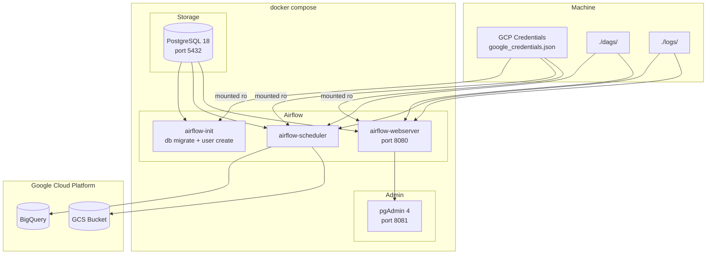
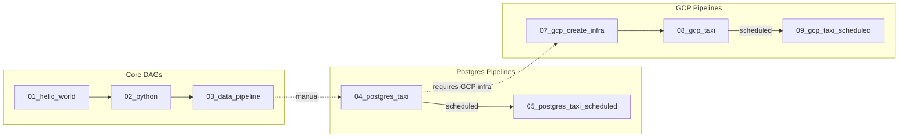
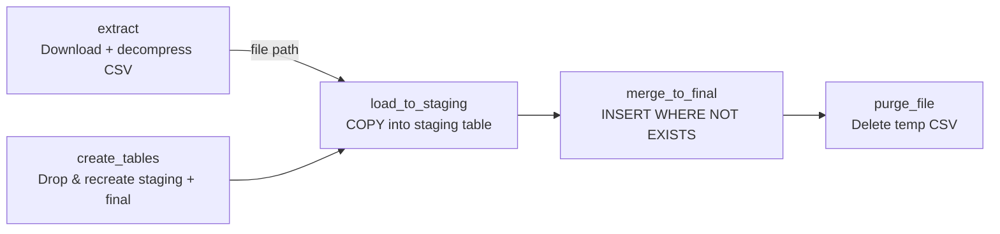
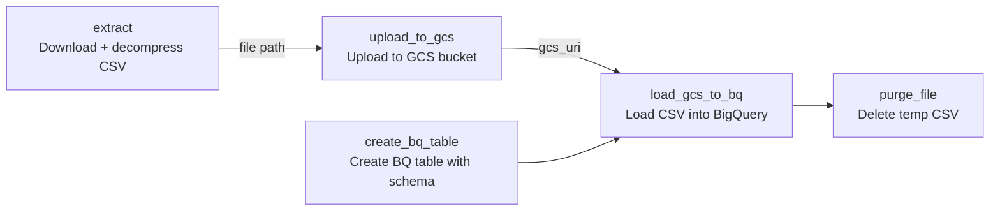
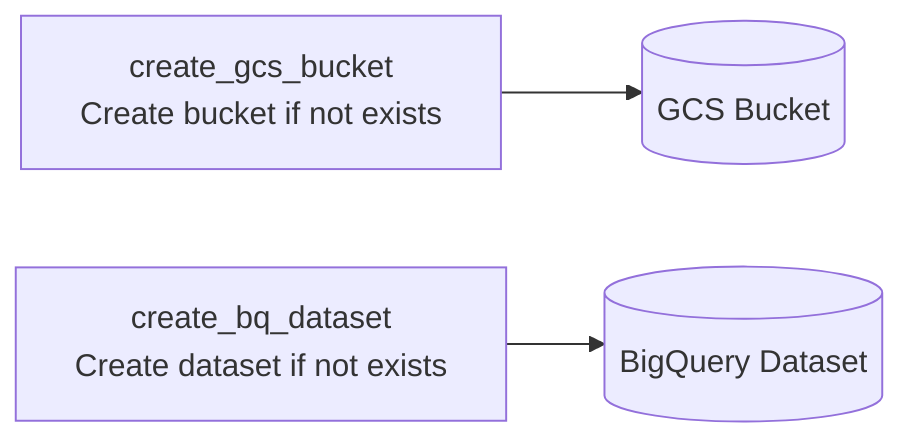

# docker-practice

A hands-on project for learning Docker, Apache Airflow, PostgreSQL, and GCP — built as part of the Data Engineering Zoomcamp.

## Architecture



The project uses Docker Compose to run four services, all connected via a shared Docker network:

| Service | Image | Purpose |
|---|---|---|
| `postgres` | `postgres:18` | Metadata DB for Airflow + taxi data storage in `zoomcamp` DB |
| `pgadmin` | `dpage/pgadmin4:9.14` | Web UI to browse PostgreSQL (port `8081`) |
| `airflow-webserver` | `apache/airflow:2.9.3` | Airflow UI (port `8080`) |
| `airflow-scheduler` | `apache/airflow:2.9.3` | Executes DAG tasks |
| `airflow-init` | `apache/airflow:2.9.3` | Runs `airflow db migrate` + creates admin user on first start |

Airflow is configured with `LocalExecutor`, connections are injected via environment variables, and GCP credentials are mounted from the host.

## Project Structure

```
├── dags/                 # Airflow DAGs (pipeline definitions)
├── pipeline/             # Standalone data ingestion scripts (uv-managed Python project)
├── plugins/              # Airflow plugins (empty)
├── test/                 # Misc test files
├── logs/                 # Airflow task logs
├── docker-compose.yml    # Service definitions
├── init-db.sql           # Creates the zoomcamp database on PostgreSQL startup
├── .env                  # AIRFLOW_UID=1000
├── commads.txt           # Useful CLI commands
└── debug.md              # Troubleshooting log
```

## DAGs

| DAG | Trigger | Description |
|---|---|---|
| `01_hello_world` | Manual | Prints "Hello from Airflow!" — a basic sanity check |
| `02_python` | Manual | Fetches DockerHub pull count for `kestra/kestra` via API |
| `03_getting_started_data_pipeline` | Manual | Downloads products from dummyjson.com, filters columns (param), stores into `products` table in Postgres |
| `04_postgres_taxi` | Manual | Downloads NYC taxi CSV (yellow/green), loads into Postgres staging table, deduplicates via MD5, merges into final table |
| `05_postgres_taxi_scheduled` | Cron `0 9 1 * *` | Same as DAG 04 but scheduled monthly with backfill (`catchup=True`) |
| `07_gcp_create_infra` | Manual | Creates a GCS bucket and BigQuery dataset via Airflow GCP hooks |
| `08_gcp_taxi` | Manual | Downloads NYC taxi CSV, uploads to GCS, creates BQ table with typed schema, loads from GCS into BigQuery |
| `09_gcp_taxi_scheduled` | Cron `0 9 1 * *` | Same as DAG 08 but scheduled monthly with backfill |



All DAGs require the Docker services to be running (`docker compose up -d`). The Airflow UI is at `http://localhost:8080` (login: `admin` / `admin`).

### DAG 04 / 05 — Postgres Taxi Pipeline



Pipeline: `extract → create_tables → load_to_staging → merge_to_final → purge_file`

1. **extract** — Downloads `{taxi}_tripdata_{year}-{month}.csv.gz` from GitHub and decompresses using pure Python (`urllib` + `gzip`)
2. **create_tables** — Drops and recreates `{taxi}_tripdata_staging` and `{taxi}_tripdata` tables
3. **load_to_staging** — Truncates staging, `COPY` from CSV, computes MD5 hash for dedup, tags filename
4. **merge_to_final** — `INSERT ... WHERE NOT EXISTS` based on `unique_row_id`
5. **purge_file** — Deletes the temp CSV

### DAG 08 / 09 — GCP Taxi Pipeline



Pipeline: `extract → upload_to_gcs → (parallel: create_bq_table) → load_gcs_to_bq → purge_file`

1. **extract** — Downloads taxi CSV via pure Python
2. **upload_to_gcs** — Uploads CSV to GCS bucket (name from `GCP_BUCKET_NAME` variable)
3. **create_bq_table** — Creates BigQuery table with typed column schema (yellow or green)
4. **load_gcs_to_bq** — Loads CSV from GCS into BQ (`WRITE_APPEND`, skip header)
5. **purge_file** — Deletes the temp CSV

### DAG 07 — GCP Infrastructure Setup



- **create_gcs_bucket** — Creates bucket in configured project/location (skips if exists)
- **create_bq_dataset** — Creates BigQuery dataset (skips if exists)

## Pipeline (Standalone Python Project)

The `pipeline/` directory is a uv-managed Python 3.13 project with data ingestion scripts:

| File | Description |
|---|---|
| `ingest_data.py` | Downloads NYC yellow taxi CSV in chunks and loads into PostgreSQL via SQLAlchemy |
| `ingest_zone.py` | Downloads `taxi_zone_lookup.csv` and loads it into PostgreSQL |
| `pipeline.py` | Simple pandas pipeline demo (takes a day argument, creates parquet) |
| `main.py` | Hello-world entry point |
| `Dockerfile` | Builds a Docker image with uv + Python deps, entrypoint `uv run python` |

### Building and Running the Ingest Container

```bash
docker build -t taxi_ingest:v001 pipeline/

docker run -it --rm \
  --network=docker-practice_default \
  taxi_ingest:v001 \
  ingest_data.py \
    --pg-user=root --pg-pass=root --pg-host=pgdatabase \
    --pg-port=5432 --pg-db=ny_taxi --year=2021 --month=1 \
    --target-table=yellow_taxi_trips
```

## Getting Started

```bash
# Start all services
docker compose up -d

# Access Airflow UI
open http://localhost:8080   # admin / admin

# Access pgAdmin
open http://localhost:8081   # admin@example.com / admin

# Connect to PostgreSQL directly
uv run --with pgcli --with psycopg-binary pgcli -h localhost -p 5432 -u airflow -d zoomcamp

# Stop everything
docker compose down

# Stop and wipe volumes (resets all data)
docker compose down -v
```

## Environment Variables (`.env`)

- `AIRFLOW_UID=1000` — Ensures file permissions match the host user

## Prerequisites

- Docker & Docker Compose
- Python 3.13+ with `uv` (for local pipeline scripts)
- GCP service account key at `/home/sagar/dtc-de-course/keys/google_credentials.json` (for GCP DAGs)

## Debugging

See [`debug.md`](./debug.md) for a detailed log of issues encountered and fixes applied during setup.
